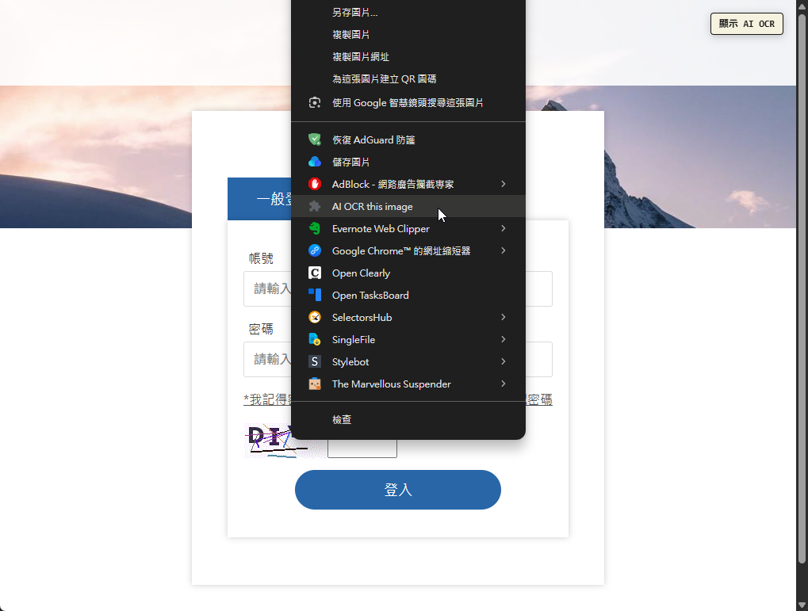

# AI Captcha OCR Extension

Internal browser extension prototype for Chrome, Firefox, and Microsoft Edge.

This local-only prototype calls either the OpenAI Responses API or the Gemini API from the extension background script.

> Warning: environment variables used by the extension build can be inspected from the built extension. Do not share the build output if it contains your API key.

## Demo

1. 啟用 Extension 後，畫面左上角會顯示 **顯示 AI OCR**。

   

2. 點選 **顯示 AI OCR** 後，可以在 Captcha image 左下角找到 OCR 小按鈕。

   

3. 解析後的文字會自動放入文字方塊中。

   

4. 或者，也可以在 Captcha image 上按滑鼠右鍵，選擇 **AI OCR the image**。

   


## Development

```bash
npm install
npm run dev
```

Create a local `.env` first:

```bash
copy .env.example .env
```

Then edit `.env`:

```env
WXT_OCR_PROVIDER=openai

WXT_OPENAI_NAME=openai
WXT_OPENAI_API_KEY=sk-proj-your-key
WXT_OPENAI_MODEL=gpt-4.1-mini
WXT_OPENAI_IMAGE_DETAIL=high
WXT_OPENAI_RESPONSES_ENDPOINT=https://api.openai.com/v1/responses

WXT_GEMINI_NAME=gemini
WXT_GEMINI_API_KEY=your-gemini-key
WXT_GEMINI_MODEL=gemini-2.5-flash
WXT_GEMINI_MAX_OUTPUT_TOKENS=512
WXT_GEMINI_THINKING_BUDGET=0
WXT_GEMINI_TIMEOUT_MS=30000
WXT_GEMINI_ENDPOINT=https://generativelanguage.googleapis.com/v1beta

WXT_OCR_IMAGE_SCALE=4
```

`WXT_OCR_PROVIDER` selects the provider by matching the configured provider name. With the defaults above, set `WXT_OCR_PROVIDER=openai` to use OpenAI or `WXT_OCR_PROVIDER=gemini` to use Gemini. The OpenAI and Gemini API keys are intentionally separate so both providers can be configured at the same time and switched without editing keys.

Gemini 2.5 Pro may spend part of `maxOutputTokens` on thinking tokens. If the response finishes with `MAX_TOKENS`, increase `WXT_GEMINI_MAX_OUTPUT_TOKENS`.

For low-latency CAPTCHA OCR, prefer `gemini-2.5-flash` with `WXT_GEMINI_THINKING_BUDGET=0`. If you use `gemini-2.5-pro`, thinking cannot be fully disabled; use `WXT_GEMINI_THINKING_BUDGET=128` to keep it bounded. `WXT_GEMINI_TIMEOUT_MS` prevents the extension from staying pending indefinitely.

Firefox:

```bash
npm run dev:firefox
```

## Production Builds

```bash
npm run build:chrome
npm run build:edge
npm run build:firefox
```

Packaged zip files:

```bash
npm run zip:chrome
npm run zip:edge
npm run zip:firefox
```

## Notes

- `host_permissions` is currently broad for internal testing. Narrow it after the target test sites are known.
- The popup lets you adjust the OCR prompt without rebuilding.
